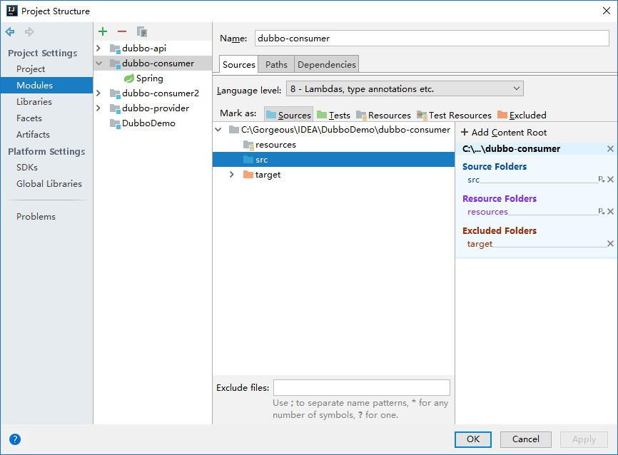
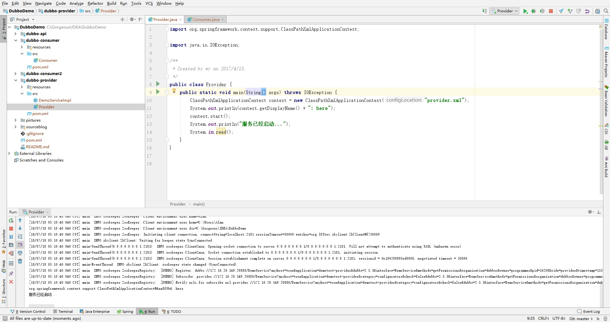
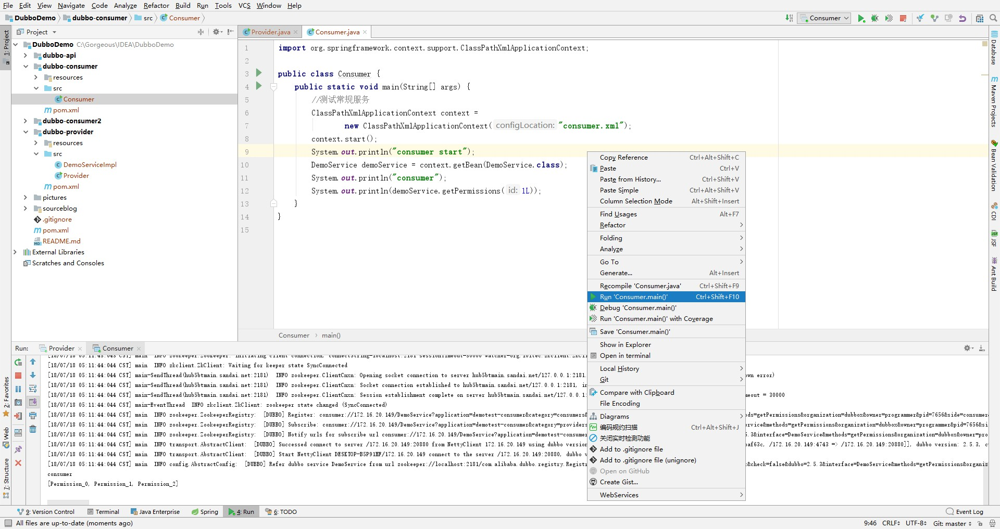

#Dubbo入门练习
###项目说明
1. 如何操作项目  
首先使用Maven自动下载Jar包，然后安装Zookeeper并启动，再右击Provider类运行，最后可以运行consumer和consumers2来测试服务。  
注意：不需要配置Tomcat。
1. Java文件右击没有Run和Debug的选项  
这是因为需要在Project Structure中，将src设置为Sources

1. 运行结果  
Provider

Consumer

###参考资料  
[《Dubbo入门---搭建一个最简单的Demo框架》](https://blog.csdn.net/noaman_wgs/article/details/70214612)  
[《zookeeper安装和使用 windows环境》](https://blog.csdn.net/tlk20071/article/details/52028945)  
[《nomico271/DatatablesDemo》](https://github.com/nomico271/DatatablesDemo)